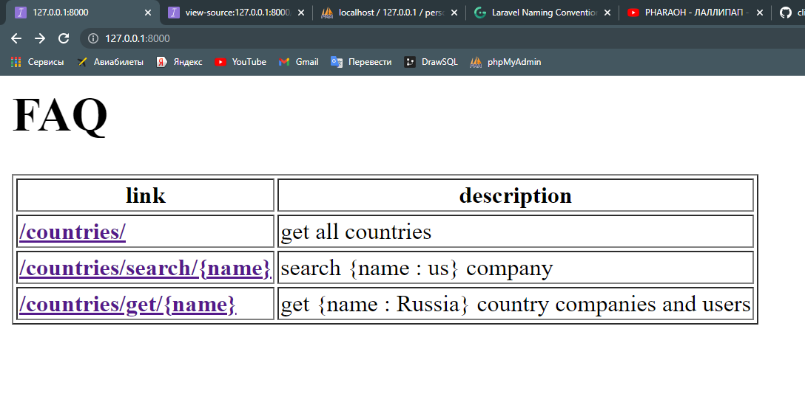
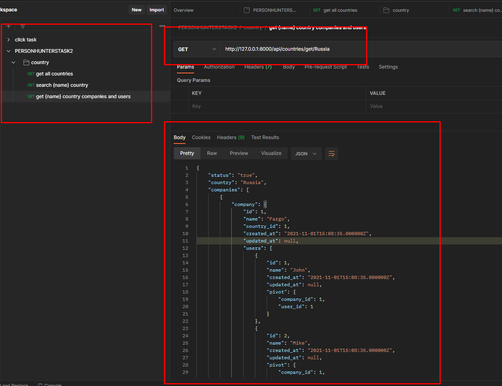

# Set up:

1. Clone it: `git clone url`
2. Set `.env` file
3. Migrate database and seed: `php artisan migrate:fresh --seed`
4. Run it: `php artisan serve`

## If you use test it with web view you should see:

## If you decided to test it using rest API, so do it

1. Insert postman collection file to your postman: `PERSONHUNTERSTASK2.postman_collection.json`
2. Then you should see ready collections:

